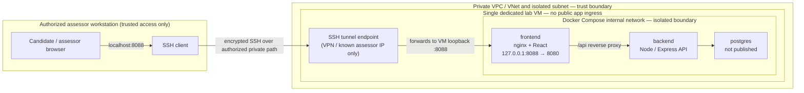

# PeopleMatrix Security Assessment Lab

> **THIS APPLICATION IS INTENTIONALLY VULNERABLE. DO NOT EXPOSE IT TO THE PUBLIC INTERNET OR CONNECT IT TO PRODUCTION SYSTEMS.**

PeopleMatrix is a synthetic HR application for authorized security training and assessment. Run it only on a **single dedicated, isolated lab VM** with synthetic data. Never use real employee information, production credentials, or production-connected systems. Do not deploy it publicly.

The AWS and Azure deployment guides describe safe infrastructure patterns, not a deployment performed by this project. Docker must be validated on a dedicated isolated lab VM, not in the Replit environment. Administrators should consult the private Phase 6 validation record in `assessor/PHASE6_VALIDATION.md` for the remaining VM checks; do not treat these instructions as evidence that a Docker or cloud deployment has been validated.

## Purpose

This lab gives authorized candidates an HR-style application to assess in a controlled environment. The data is synthetic, and the application includes deliberately vulnerable assessment behavior. Only designated administrators may access assessor materials and audit information.

## Architecture and trust boundaries

The supported lab shape is one dedicated VM, with application access through an authorized SSH tunnel. The VM belongs in a private VPC/VNet and isolated subnet. Permit only the minimum required inbound management access from a VPN or known assessor IP; do not allow direct application ingress from the network or public Internet.



The frontend is the only Compose service bound to the VM host, and it binds only `127.0.0.1:${LAB_PORT:-8088}:8080`. Backend and PostgreSQL ports are not published; they communicate only on the Docker internal network. The browser reaches the VM's loopback-bound frontend through an SSH local port forward.

## Prerequisites

- One newly provisioned, dedicated Linux VM in a private, isolated VPC/VNet subnet.
- VPN or another private access path, or a fixed known assessor source IP for narrowly scoped SSH access.
- Docker Engine and the Docker Compose plugin installed on the VM.
- An authorized administrator account with permission to manage Docker and the lab VM.
- OpenSSL to generate the lab secrets.
- The repository and its deployment files available on the VM through an approved private method.

Do not add public application ingress, a public load balancer, or a public database endpoint. Do not reuse this VM for production or unrelated workloads.

## Installation and secrets

On the dedicated VM, obtain the project using your organization's approved private source-control or artifact process. Review the files and confirm you are on the intended lab VM before proceeding. The Compose contract is:

- `frontend`, `backend`, and `postgres` services.
- nginx serves the React frontend and reverse-proxies `/api` to `backend`.
- Only frontend is host-published, bound as `127.0.0.1:${LAB_PORT:-8088}:8080`.
- Backend and PostgreSQL have no published host ports and use the Docker internal network.
- Health checks are configured; startup applies the backend schema and runs the idempotent seed.

Copy `.env.example` to `.env`. Generate **separate** values for `POSTGRES_PASSWORD` and `SESSION_SECRET` with `openssl rand -hex 32`, and put those values in `.env`:

```sh
cp .env.example .env
chmod 600 .env
openssl rand -hex 32
openssl rand -hex 32
```

Use the first generated value for `POSTGRES_PASSWORD` and the second for `SESSION_SECRET`, replacing the corresponding values in `.env`. Keep `.env` readable only by the lab administrator; never commit, publish, or send it to candidates. Do not reuse either value outside this lab. Keep `LAB_PORT` unset for the default port 8088, or set it to another approved local port if necessary.

## Docker startup

From the project directory on the dedicated VM:

```sh
docker compose --env-file .env up --build -d
```

The backend schema push and idempotent seed run at startup. Check `docker compose --env-file .env ps` and wait for the frontend, backend, and PostgreSQL health checks to report healthy before opening the candidate session. Confirm that the only published application binding is on `127.0.0.1`; backend and PostgreSQL must remain unpublished. The containers have **not** been built or run in Replit; verify this on the isolated lab VM before use. Run the private maintainer suite inside the isolated backend container as described in the Phase 6 validation record. The backend image contains only the lab setup fixture and maintainer test, not the private assessor answer key or scoring guide.

To deploy automatically from GitHub Actions instead (push to `main` or a manual run), see [`docs/DEPLOY.md`](docs/DEPLOY.md). It covers the required secrets, the VM layout, and rollback.

From an authorized workstation, create an SSH local port forward through the permitted private route:

```sh
ssh -N -L 8088:127.0.0.1:8088 <authorized-vm-user>@<private-vm-host>
```

If `LAB_PORT` was changed on the VM, use that port as the remote forwarding target (and choose a suitable local port). Keep the SSH session open, then browse to `http://127.0.0.1:8088` on the authorized workstation. Never make the application port directly reachable from candidate networks or the Internet; provide candidate access only through an explicitly authorized, controlled route and the SSH tunnel.

## Test credentials

The lab account list and passwords are maintained in [`docs/PHASE2_SETUP.md`](docs/PHASE2_SETUP.md). These are public lab-only test credentials, not secrets. Provide candidates only the Employee and Manager accounts. Do not distribute HR administrator or system administrator credentials to candidates. Never reuse lab passwords in any other environment.

## Reset procedure

Reset only when the lab is isolated, no candidate session is active, and the administrator has confirmed the target is the dedicated lab Compose database. The reset script must require `LAB_ISOLATED_DB=1` and an interactive confirmation. It is intended to destroy **only the dedicated Compose lab volume**, then recreate and reseed the lab database; it must never target another volume or database.

Run from the project directory in an interactive administrator shell:

```sh
LAB_ISOLATED_DB=1 ./scripts/reset-lab.sh
```

Read the confirmation prompt carefully and proceed only if it identifies the dedicated lab target. If the isolation guard or confirmation is absent, stop; do not substitute a broad `docker compose down -v` or manually remove volumes. Reset removes candidate-created data and audit history and restores the seeded lab state.

## Candidate preparation

1. Verify the VM is dedicated to this lab, the subnet is private, the security rules allow only the approved VPN/known assessor IP management path, and there is no public application ingress.
2. Confirm synthetic seed data is present and test the application using an Employee and Manager account.
3. Give candidates the scope, rules of engagement, access instructions, and only the Employee and Manager test credentials.
4. Do not provide administrator credentials, the private answer key, scoring guide, maintainer checks, or assessor-only material.
5. Never expose the private answer key or scoring guide through the frontend, API, candidate files, or a candidate-accessible host path. Keep assessor artifacts in a separate administrator-only location.
6. Tell candidates the authorized target and testing window. Revoke their access when the exercise ends.

## Assessor workflow

Before the exercise, confirm the isolated network controls and health checks, then verify the candidate accounts. During and after the exercise, an authorized system administrator can review recent audit events through the role-protected `/api/v1/audit` endpoint or the application's Audit UI. For the complete audit history, an assessor with access to the dedicated VM can run the private, read-only export below into an administrator-only directory (created separately). Never serve the JSONL file to candidates.

```sh
docker compose --env-file .env exec -T -e LAB_ISOLATED_DB=1 backend \
  pnpm --silent --filter @workspace/api-server run audit:export > /secure/lab-audit.jsonl
```

The export includes timestamps, account IDs, source IP as observed by the API (often the proxy address), methods, endpoint paths, actions, and statuses. Protect or discard it under the organization's lab data-retention process.

After the assessment, disable candidate access and, when preparing a fresh exercise, use the guarded reset procedure above. Do not connect the lab to production identity, email, HR, or monitoring systems.

## Troubleshooting

- **Compose reports unhealthy services:** Check service health status and container output on the VM. Confirm `.env` is present, secret values are set, and the VM has sufficient resources. Do not publish backend or database ports as a workaround.
- **Frontend unavailable in the SSH tunnel:** Confirm the frontend is healthy, the configured `LAB_PORT` matches the SSH remote target, the Compose bind is loopback-only, and the SSH session is still open. Verify you are browsing to the local forwarded port.
- **SSH connection fails:** Check the private route/VPN, VM address, SSH service, and the narrowly scoped security rule for the authorized source. Do not open SSH to all Internet addresses to troubleshoot.
- **Login fails:** Verify the account and lab password in `docs/PHASE2_SETUP.md`, and confirm the idempotent seed completed. Do not send administrator credentials to a candidate.
- **Reset guard blocks the operation:** Stop and verify the dedicated VM/database target. Run only from an interactive shell with `LAB_ISOLATED_DB=1`; never bypass the guard or broaden the deletion scope.
- **Docker build or reset fails:** Preserve the error output privately for the lab maintainer. Do not open a public port, disable network isolation, or delete any other database or Docker volume to troubleshoot.

## Security warning

> **THIS APPLICATION IS INTENTIONALLY VULNERABLE. DO NOT EXPOSE IT TO THE PUBLIC INTERNET OR CONNECT IT TO PRODUCTION SYSTEMS.**

Use one dedicated isolated VM, private VPC/VNet/subnet, tightly restricted VPN/known-assessor-IP access, no public application ingress, and an SSH tunnel from an authorized host. Use synthetic data only. Never deploy this application outside an authorized, isolated assessment lab.